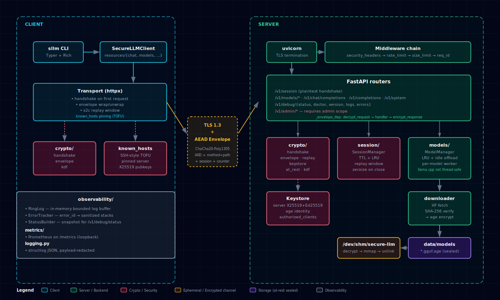
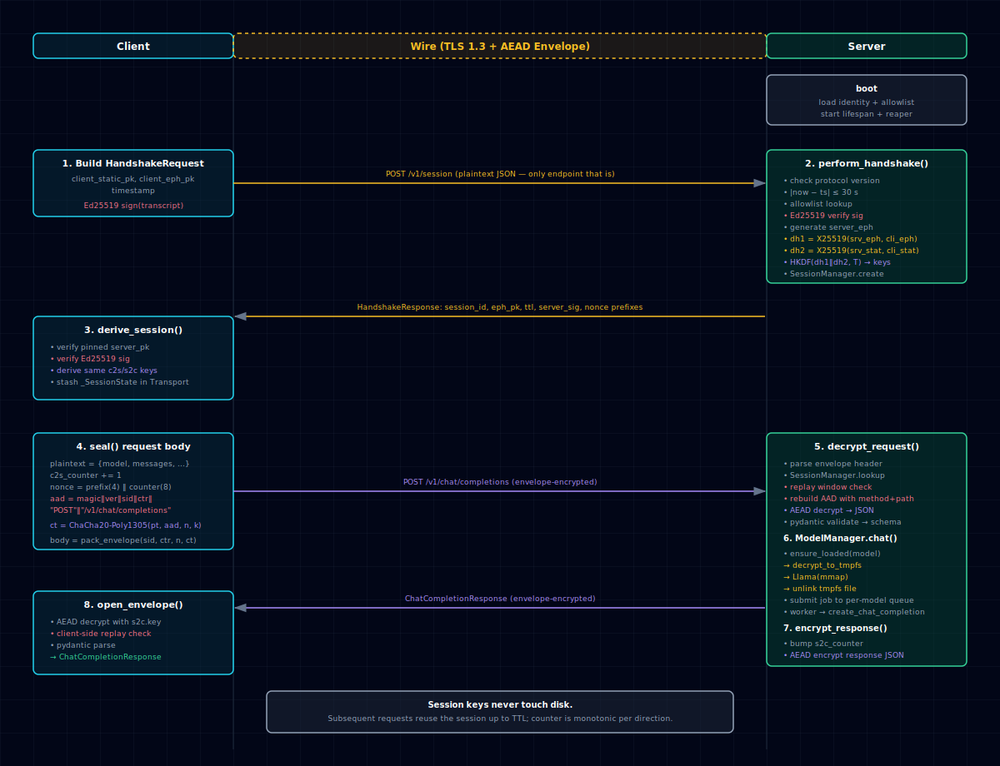
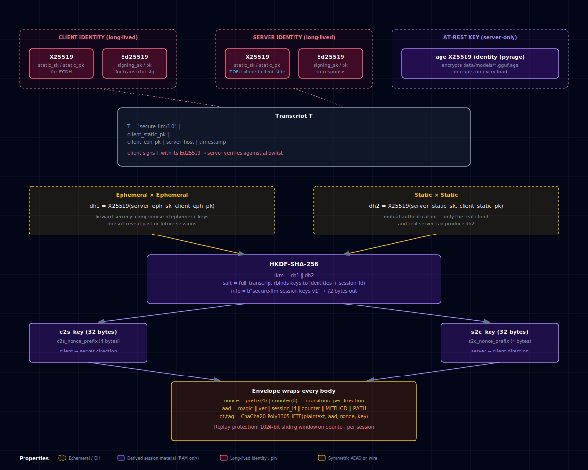
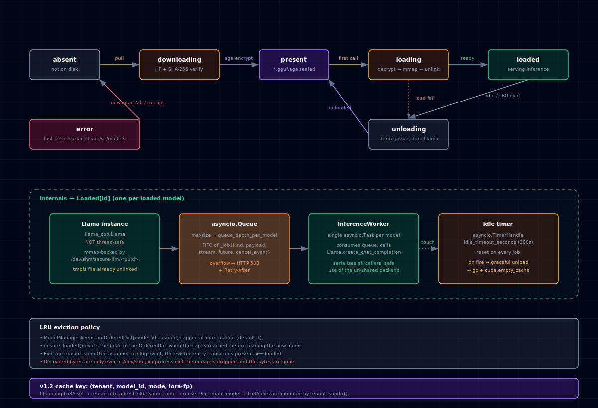

# secure-llm

> A self-hostable LLM inference service where **prompts and responses are
> unreadable to anyone with disk, log, network, or backup access to the
> server.** The OpenAI-shaped Python SDK and `sllm` CLI drive a
> `llama.cpp`-backed FastAPI server across a static+ephemeral X25519
> handshake and an application-layer ChaCha20-Poly1305 envelope.

[](pyproject.toml)
[](docs/protocol.md)
[](LICENSE)

---

## Table of contents

- [Why this exists](#why-this-exists)
- [What you get](#what-you-get)
- [Threat model in one paragraph](#threat-model-in-one-paragraph)
- [Architecture](#architecture)
  - [Component map](#component-map)
  - [Request lifecycle](#request-lifecycle)
  - [Cryptographic flow](#cryptographic-flow)
  - [Wire format](#wire-format)
  - [Model lifecycle](#model-lifecycle)
- [Quick start](#quick-start)
- [How the encryption actually works](#how-the-encryption-actually-works)
- [Repository layout](#repository-layout)
- [Make targets](#make-targets)
- [Client SDK](#client-sdk)
- [`sllm` CLI](#sllm-cli)
- [Server-side admin + debug APIs](#server-side-admin--debug-apis)
- [Configuration](#configuration)
- [Operations](#operations)
- [Testing](#testing)
- [Performance + scaling](#performance--scaling)
- [Deployment](#deployment)
- [Security & disclosure](#security--disclosure)
- [Out of scope (v1)](#out-of-scope-v1)
- [License](#license)

---

## Why this exists

If you self-host an LLM with a stock OpenAI-compatible server, every
prompt your users send arrives in plaintext on the server. It lives in
logs, crash dumps, backups, monitoring snapshots — wherever you forgot
to look. For most workloads that's fine; for some (legal, medical,
security research, internal regulated data) it's a non-starter.

`secure-llm` is the same OpenAI-shaped interface, but the server
**cannot read its own traffic at rest.** Prompts and responses are
encrypted by an application-layer envelope keyed to a per-session secret
that exists only in server RAM and is forward-secret. TLS still protects
the metadata. Model files on disk are `age`-encrypted; decryption
happens into tmpfs and the file is `unlink()`'d the moment `llama.cpp`
mmaps it.

## What you get

- **A FastAPI server** that loads GGUF models on demand and unloads them
  after an idle timeout. One inference worker per loaded model
  (`llama_cpp.Llama` is not thread-safe). Idle offload + LRU eviction.
- **An OpenAI-shaped Python SDK** (`SecureLLMClient`) that handles the
  handshake, envelope encryption, replay protection, and pubkey pinning
  transparently. Caller code looks like the OpenAI SDK.
- **A `sllm` CLI** for chat, completions, model management, system
  inspection, and operator/admin tasks.
- **Encryption at rest** for model weights via `age` (pyrage).
- **Debug + admin APIs** so operators can introspect status, recent
  errors, queue depth, log tail, and effective config — *over the same
  encrypted channel* — without shelling into the host.
- **Production scaffolding**: structlog with payload redaction,
  Prometheus metrics, health probes, in-memory ring log, error tracker,
  audit log, per-client rate limit, request size limit, security
  headers, graceful shutdown, hardened systemd unit, distroless
  Dockerfile, GitHub Actions.

## Threat model in one paragraph

**Defends against**: passive and active network attackers (TLS + AEAD),
on-disk attackers (encrypted model files, payload-redacted logs),
backup/cold-storage compromise, replay attacks (sliding-window nonce
protection + AAD-bound counters), stolen client keys (allowlist
revocation). **Does not defend against**: root on the running server
(plaintext is in RAM during inference — only a TEE solves that, which
is out of scope), multi-tenant mutual distrust on one server, side
channels in `llama.cpp` itself. Full STRIDE table:
[`docs/threat-model.md`](docs/threat-model.md).

---

## Architecture

> All four diagrams below are rendered SVGs from
> [`docs/diagrams/`](docs/diagrams/index.md). Each is also available as a
> self-contained HTML page with a Copy / PNG / PDF export toolbar — open
> the linked `.html` next to each image. Regenerate everything with
> `make diagrams`. ASCII fallbacks follow each image in case the SVG
> doesn't render in your viewer.

### Component map



Interactive: [`component-map.html`](docs/diagrams/component-map.html)

<details>
<summary>ASCII fallback</summary>

```
┌──────────────────────────────────────────────────────────────────────────┐
│                                 CLIENT                                   │
│                                                                          │
│   sllm CLI ──► SecureLLMClient ──► ChatResource / ModelsResource / ...   │
│                       │                                                  │
│                       ▼                                                  │
│   ┌─────────────  Transport (httpx)  ──────────────┐                     │
│   │  • performs handshake on first request         │                     │
│   │  • wraps every body in envelope (ChaCha20)     │                     │
│   │  • s2c replay window                           │                     │
│   │  • known_hosts pinning (TOFU)                  │                     │
│   └────────────────────────────────────────────────┘                     │
│                       │                                                  │
└───────────────────────┼──────────────────────────────────────────────────┘
                        │                  TLS 1.3
                        │                  +
                        │     application-layer AEAD envelope
                        ▼
┌──────────────────────────────────────────────────────────────────────────┐
│                                 SERVER                                   │
│                                                                          │
│   uvicorn (--ssl-* TLS termination)                                      │
│       │                                                                  │
│       ▼                                                                  │
│   FastAPI app                                                            │
│       │   ┌── middleware chain ────────────────────────────────────┐     │
│       │   │ security_headers → rate_limit → size_limit → req_id    │     │
│       │   └────────────────────────────────────────────────────────┘     │
│       │                                                                  │
│       ▼                                                                  │
│   ┌─ routers/ ────────────────────────────────────────────────────┐      │
│   │  session   /v1/session    (plaintext handshake)               │      │
│   │  models    /v1/models/*                                       │      │
│   │  chat      /v1/chat/completions                               │      │
│   │  completions /v1/completions                                  │      │
│   │  system    /v1/system                                         │      │
│   │  debug     /v1/debug/*    (status, doctor, logs, errors)      │      │
│   │  admin     /v1/admin/*    (sessions, models, config, gc, ...) │      │
│   │   all envelope endpoints go through _envelope_dep:            │      │
│   │     decrypt_request() → handler → encrypt_response()          │      │
│   └───────────────────────────────────────────────────────────────┘      │
│       │                  │                       │                       │
│       ▼                  ▼                       ▼                       │
│  ┌──────────┐    ┌────────────────┐    ┌──────────────────────┐          │
│  │ crypto/  │    │ session/       │    │ models/              │          │
│  │ handshake│    │ SessionManager │    │ ModelManager         │          │
│  │ envelope │    │  • TTL + LRU   │    │  ┌─────────────────┐ │          │
│  │ replay   │    │  • zeroize     │    │  │ Loaded[id]      │ │          │
│  │ keystore │    │    on delete   │    │  │ ├─ Llama        │ │          │
│  │ at_rest  │    └────────────────┘    │  │ ├─ queue        │ │          │
│  └──────────┘                          │  │ ├─ worker task  │ │          │
│       │                                │  │ └─ idle timer   │ │          │
│       │                                │  └─────────────────┘ │          │
│       ▼                                │  • LRU eviction      │          │
│  ┌──────────────────────────┐          │  • idle-timeout      │          │
│  │ keystore                 │          │    offload           │          │
│  │  • server X25519+Ed25519 │          └──────────────────────┘          │
│  │  • age identity          │                  │                         │
│  │  • authorized_clients    │                  ▼                         │
│  └──────────────────────────┘          ┌──────────────────────┐          │
│                                        │ downloader           │          │
│                                        │  HF → SHA-256 verify │          │
│                                        │   → age-encrypt      │          │
│                                        │   → write *.gguf.age │          │
│                                        └──────────────────────┘          │
│                                                  │                       │
│                                                  ▼                       │
│                                        ┌──────────────────────┐          │
│                                        │ data/models/*.age    │          │
│                                        │   (at-rest encrypted)│          │
│                                        └──────────────────────┘          │
│                                                  │                       │
│                                                  ▼                       │
│                                        ┌──────────────────────┐          │
│                                        │ /dev/shm/secure-llm/ │          │
│                                        │  decrypt → mmap →    │          │
│                                        │  unlink (RAM only)   │          │
│                                        └──────────────────────┘          │
│                                                                          │
│   observability/        metrics/         logging.py                      │
│   ├─ RingLog           Prometheus       structlog JSON                   │
│   ├─ ErrorTracker      (/metrics)       payload-redacted                 │
│   └─ StatusBuilder                      ring-buffered                    │
└──────────────────────────────────────────────────────────────────────────┘
```
</details>

### Request lifecycle



Interactive: [`request-lifecycle.html`](docs/diagrams/request-lifecycle.html)

<details>
<summary>ASCII fallback — single end-to-end chat completion</summary>

```
client                                    server
──────                                    ──────
                                          (boot: load identity from keystore,
                                           load allowlist, start lifespan)

1. POST /v1/session  (plaintext JSON — the only endpoint that is)
   ┌─ HandshakeRequest ─────────────────┐
   │ client_static_pk, client_eph_pk    │
   │ timestamp, transcript_sig (Ed25519)│
   └────────────────────────────────────┘
                                  ─────►  perform_handshake()
                                          - check protocol version
                                          - check |now - ts| ≤ 30s
                                          - allowlist lookup
                                          - Ed25519 verify transcript_sig
                                          - generate server_eph
                                          - dh1 = X25519(server_eph_sk, client_eph_pk)
                                          - dh2 = X25519(server_static_sk, client_static_pk)
                                          - HKDF(dh1‖dh2, transcript) → session keys
                                          - SessionManager.create(material)
                                          - sign full transcript w/ Ed25519
   ◄──── HandshakeResponse ──────────────
   ┌────────────────────────────────────┐
   │ session_id, server_eph_pk,         │
   │ server_static_pk, server_ed25519_pk│
   │ ttl, server_sig, nonce_prefix_c2s, │
   │ nonce_prefix_s2c                   │
   └────────────────────────────────────┘
   - verify pinned server_static_pk
   - verify Ed25519 sig
   - derive identical session keys
   - stash _SessionState in Transport

2. POST /v1/chat/completions  (every body from here is encrypted)
   plaintext = {"model":..., "messages":[...], ...}
   c2s_counter += 1
   nonce  = nonce_prefix_c2s ‖ counter(8)
   aad    = magic‖ver‖sid‖counter‖"POST"‖"/v1/chat/completions"
   ct,tag = ChaCha20-Poly1305-IETF(plaintext, aad, nonce, c2s.key)
   body   = pack_envelope(sid, counter, nonce, ct‖tag)
                                  ─────►  decrypt_request()
                                          - parse envelope
                                          - SessionManager.lookup(sid)
                                          - replay window: check_and_advance
                                          - rebuild AAD with method+path
                                          - AEAD decrypt → JSON
                                          - pydantic validate → schema
                                          session.touch()
                                          ModelManager.chat(...)
                                          ├─ ensure_loaded(model)
                                          │   - decrypt_to_tmpfs(<sha>.gguf.age)
                                          │   - Llama(mmap), unlink tmpfs
                                          │   - spawn InferenceWorker
                                          ├─ submit job onto per-model queue
                                          └─ worker calls Llama.create_chat_completion
                                          encrypt_response()
                                          - bump s2c_counter
                                          - AEAD encrypt response JSON
   ◄──── encrypted ChatCompletionResponse
   open_envelope(s2c keys, method, path)
   pydantic parse → ChatCompletionResponse
```
</details>

### Cryptographic flow



Interactive: [`crypto-flow.html`](docs/diagrams/crypto-flow.html)

<details>
<summary>ASCII fallback</summary>

```
                                 ┌──────────────────────────────┐
        long-lived (TOFU pin)    │ client static (X25519 + Ed25)│
                                 │ server static (X25519 + Ed25)│
                                 │ age recipient (model at-rest)│
                                 └──────────────────────────────┘
                                                │
                                                │  ← used during handshake
                                                ▼
HANDSHAKE
                   ┌────────────────────────────────────────────────┐
                   │     T = "secure-llm/1.0"                       │
                   │       ‖ client_static_pk                       │
                   │       ‖ client_eph_pk                          │
                   │       ‖ server_host                            │
                   │       ‖ timestamp                              │
                   └────────────────────────────────────────────────┘
                                       │
client signs T with its Ed25519 ───────┴────────► server verifies w/ allowlist
                                       │
                                       │  (timestamp, scopes, revocation,
                                       │   not_before/after all checked)
                                       │
                            server generates ephemeral X25519
                                       │
              dh1 = X25519(server_eph_sk, client_eph_pk)
              dh2 = X25519(server_static_sk, client_static_pk)
              ikm = dh1 ‖ dh2                       ← mixes ephemeral+static
                                       │              for FS + KCI-resistance
                                       ▼
              session_key_material = HKDF-SHA-256(
                  ikm     = ikm,
                  salt    = full_transcript,        ← binds keys to identity
                  info    = b"secure-llm session keys v1",
                  length  = 32 + 32 + 4 + 4
              )
                                       │
                            ┌──────────┴──────────┐
                            ▼                     ▼
                       c2s_key (32B)        s2c_key (32B)
                       c2s_prefix (4B)      s2c_prefix (4B)


ENVELOPE  (everything except /v1/session)

      AAD = magic ‖ version ‖ session_id ‖ counter ‖ METHOD ‖ PATH

      So a captured envelope can't be replayed against a different
      endpoint, and an attacker can't swap GET for POST or
      /v1/system for /v1/admin/shutdown.

      Replay window: server keeps a 1024-bit sliding bitmap per session;
      duplicates and out-of-window counters are rejected as
      `replay_detected` with uniform error latency.


AT-REST  (model files)
       data/models/<sha256-of-plaintext>.gguf.age    ←  age(server_recipient,
                                                          gguf_bytes)
       data/models/<sha256>.meta.json                ←  non-secret metadata

       load path:
         encrypted blob ──► pyrage.decrypt ──► /dev/shm/secure-llm/<uuid>.gguf
                                                       │
                                          Llama(mmap-only) opens the path
                                                       │
                                          immediately os.unlink(<uuid>.gguf)
                                                       │
                                          bytes survive only in the mmap +
                                          page-cache; gone on process exit.
```
</details>

### Wire format

```
┌──────────┬──────────┬──────────────┬───────────┬───────────┬──────────────┬────────┐
│  magic   │ version  │  session_id  │  counter  │   nonce   │  ciphertext  │  tag   │
│ 4 bytes  │ 1 byte   │  16 bytes    │ 8 bytes   │ 12 bytes  │   N bytes    │ 16 B   │
│  "SLLM"  │   0x01   │  opaque ID   │  big-end  │ prefix‖ctr│  ChaCha20    │ Poly13 │
└──────────┴──────────┴──────────────┴───────────┴───────────┴──────────────┴────────┘
                                                                   │
       AAD = magic ‖ version ‖ session_id ‖ counter ‖ method ‖ path
```

Canonical definitions: [`protocol/secure_llm_protocol/wire.py`](protocol/secure_llm_protocol/wire.py).
Schemas: [`protocol/secure_llm_protocol/schemas.py`](protocol/secure_llm_protocol/schemas.py).
Byte-for-byte spec: [`docs/protocol.md`](docs/protocol.md).

### Model lifecycle



Interactive: [`model-lifecycle.html`](docs/diagrams/model-lifecycle.html)

<details>
<summary>ASCII fallback — state machine per model id</summary>

```
state machine per model id:

      absent ──pull──► downloading ──verify+encrypt──► present
                                                         │
                                                         │ inference call
                                                         ▼
                                                       loading
                                                         │ decrypt→mmap→unlink
                                                         ▼
   present ◄──unload──   loaded   ◄── inference jobs ──┐
              ▲           │  ▲                          │
              │ idle      │  └── per-model asyncio.Queue│
              │ timeout   │      single worker task     │
              └──────────fired                          │
                          │                             │
                          └── max_loaded LRU eviction ──┘
```
</details>

- `max_loaded = 1` (default; raise it if you have RAM/VRAM for more).
- `idle_timeout_seconds = 300` (default; reset on every job).
- Queue depth per model bounded; overflow → HTTP 503 + `Retry-After`.
- Per-model **single inference worker** task because `llama_cpp.Llama`
  is not thread-safe. Concurrent callers share the queue.

---

## Quick start

Tested on Linux + macOS, Python 3.11/3.12/3.13. Requires only `uv` —
the bootstrap script installs it if it's missing, to `~/.local/bin`,
no sudo.

```bash
git clone <this repo> && cd secure-llm
make bootstrap        # builds .venv, gens TLS + identity, runs doctor
make run              # foreground server on https://127.0.0.1:8443
```

In another shell:

```bash
make smoke            # full e2e: handshake, debug.status, models.list, admin.log_level
```

To talk to it from real code, you also need a client identity in the
server's allowlist. The smoke target does this automatically; manually:

```bash
mkdir -p ~/.secure-llm
uv run sllm keygen --out ~/.secure-llm/client
# copy the printed [[clients]] block into data/keys/authorized_clients.toml,
# then on the client side pin the server pubkey:
uv run sllm trust 127.0.0.1:8443 "$(base64 -w0 < data/keys/server.x25519.key.pub)"
```

Now from Python:

```python
from secure_llm_client import SecureLLMClient

client = SecureLLMClient(
    base_url="https://127.0.0.1:8443",
    client_key_path="~/.secure-llm/client",
    known_hosts_path="~/.secure-llm/known_servers.toml",
    insecure_skip_tls_verify=True,   # dev: self-signed cert
)

resp = client.chat.completions.create(
    model="tinyllama-1.1b-chat-v1.0.Q2_K",
    messages=[{"role": "user", "content": "hello"}],
)
print(resp.choices[0].message.content)
```

---

## How the encryption actually works

The SDK does the heavy lifting; this section explains it so you can
audit what's on the wire.

**1. Identity setup.** Every party has two long-lived keypairs:

- An **X25519** keypair (for ECDH).
- An **Ed25519** keypair (for signatures over the handshake transcript).

Plus the server has an **age identity** used to encrypt model files at
rest. All three are stored in `data/keys/` with mode `0600`.

**2. Pinning.** The client stores the server's X25519 pubkey in
`known_servers.toml`. Mismatch is a hard refusal — same UX as SSH's
`known_hosts`. The server stores client X25519+Ed25519 pubkeys in
`authorized_clients.toml`, alongside per-client `scopes` (e.g.
`["chat"]` or `["chat", "admin"]`) and revocation flags.

**3. Handshake.** Plaintext JSON on the wire (the only endpoint that
is):

- Client builds the transcript `T` (protocol label, both pubkeys, host,
  timestamp), signs it with Ed25519, sends `T` + signature to
  `POST /v1/session`.
- Server validates: protocol version, timestamp skew ≤ 30 s, client is
  in the allowlist, not revoked, within validity window, signature
  verifies.
- Server generates an ephemeral X25519 keypair. Derives two
  Diffie-Hellman shares:
  - `dh1 = X25519(server_eph_sk, client_eph_pk)` — ephemeral × ephemeral
  - `dh2 = X25519(server_static_sk, client_static_pk)` — static × static
- Concatenates them as `ikm` and runs HKDF-SHA-256 with the full
  transcript as salt to derive **64 bytes of key material plus 8 bytes
  of per-direction nonce prefix**. That gives two 32-byte symmetric
  keys (one per direction) and two 4-byte nonce prefixes.
- Server signs the full transcript (including its ephemeral pubkey and
  the new `session_id`) with its Ed25519 key and returns everything to
  the client. Client verifies and derives the same key material.

This is a static+ephemeral DH, very close to Noise IK: gives mutual
authentication, forward secrecy if ephemeral keys leak, and
KCI-resistance.

**4. Envelope.** Every subsequent request and response body is wrapped
in the envelope described above. The AEAD AAD binds the envelope to its
HTTP method + path, so a captured `/v1/system` envelope can't be
replayed against `/v1/admin/shutdown`.

**5. Replay.** Counter is monotonic per direction. Server keeps a
1024-bit sliding window per session; duplicates and out-of-window
counters are rejected as `replay_detected`. Auth-rejection paths pad
latency with a uniform floor (~200 ms) to dampen timing oracles.

**6. Session keys never touch disk.** They live in `SessionManager`
only. On TTL expiry or explicit `DELETE /v1/session/{id}`, the keys are
overwritten and the entry is removed.

**7. Models at rest.** `downloader.download_and_seal` pulls a GGUF
from HF, SHA-256-verifies it, age-encrypts it under the server's
recipient, and writes `<sha256>.gguf.age`. When the model is loaded,
the bytes are decrypted into `/dev/shm/secure-llm/<uuid>.gguf` and the
dentry is immediately `unlink`'d after `Llama` mmaps the file — so the
decrypted bytes survive only in the inode cache + the live mmap, and
disappear entirely on process exit.

**8. Logs.** A structlog processor strips known sensitive keys
(`prompt`, `messages`, `content`, `delta`, `completion`, `text`,
`plaintext`, `ciphertext`, `session_key`, etc.) and refuses to
serialize raw bytes. A unit test
(`tests/unit/test_log_redaction.py`) enforces that the canary never
appears in either the JSON log file or the ring buffer.

For the byte-for-byte spec, see [`docs/protocol.md`](docs/protocol.md).
For the standing security rules that bind every PR, see
[`SECURITY.md`](SECURITY.md).

---

## Repository layout

```
secure-llm/
├── protocol/                          shared wire schemas (pydantic)
│   └── secure_llm_protocol/
│       ├── schemas.py                 request/response models
│       ├── wire.py                    envelope framing
│       ├── errors.py                  canonical ErrorCode enum
│       └── version.py                 PROTOCOL_VERSION
│
├── server/
│   ├── secure_llm_server/
│   │   ├── main.py / lifespan.py      FastAPI app, startup/shutdown
│   │   ├── config.py                  pydantic-settings, TOML + env
│   │   ├── logging.py                 structlog + payload redaction
│   │   ├── metrics.py                 Prometheus registry
│   │   ├── health.py                  /healthz, /readyz
│   │   ├── sysinfo.py                 psutil + optional pynvml
│   │   ├── crypto/
│   │   │   ├── handshake.py           X25519+Ed25519, HKDF
│   │   │   ├── envelope.py            ChaCha20-Poly1305-IETF
│   │   │   ├── replay.py              sliding-window counter check
│   │   │   ├── keystore.py            server identity + allowlist
│   │   │   ├── at_rest.py             pyrage encrypt/decrypt-to-tmpfs
│   │   │   └── kdf.py                 HKDF + fingerprint helpers
│   │   ├── session/manager.py         in-memory session table, TTL
│   │   ├── models/
│   │   │   ├── manager.py             LRU + idle-offload + workers
│   │   │   ├── downloader.py          HF + SHA-256 + age encrypt
│   │   │   └── registry.py            on-disk model catalog
│   │   ├── llm/backend.py             Llama wrapper (chat/complete)
│   │   ├── middleware/                req_id, rate_limit, size_limit,
│   │   │                              security_headers, audit
│   │   ├── observability/             ring_log, error_tracker, status
│   │   ├── routers/                   one FastAPI router per group:
│   │   │                              session, models, chat,
│   │   │                              completions, system, debug, admin
│   │   ├── scripts_doctor.py          shared by `make doctor` + /v1/debug/doctor
│   │   ├── scripts_smoke.py           used by `make smoke`
│   │   └── scripts_pretty_log.py      `make logs` pretty-printer
│   ├── deploy/
│   │   ├── systemd/secure-llm.service hardened unit
│   │   └── compose/docker-compose.yml
│   ├── Dockerfile                     multi-stage, distroless, non-root
│   └── tests/                         unit + property + integration
│
├── client/
│   └── secure_llm_client/
│       ├── client.py                  SecureLLMClient (top-level surface)
│       ├── transport.py               httpx + handshake + envelope
│       ├── known_hosts.py             SSH-style server-pubkey pinning
│       ├── errors.py                  typed exception hierarchy
│       ├── crypto/                    mirror of server crypto
│       ├── resources/                 chat / completions / models /
│       │                              system / debug / admin
│       └── cli/__main__.py            sllm CLI (Typer + Rich)
│
├── docs/
│   ├── threat-model.md                STRIDE table + scope
│   ├── protocol.md                    byte-for-byte wire spec
│   ├── operator-guide.md              install, keys, rotation, backup
│   └── runbook.md                     incident playbooks
│
├── CLAUDE.md / AGENTS.md              context for AI coding agents
├── MEMORY.md                          project journal (append-only)
├── DESIGN.md                          CLI/TUI UX rules
├── SECURITY.md                        standing rules + disclosure
├── HANDOFF.md                         "read me first if resuming"
├── CHANGELOG.md
├── Makefile                           one-click everything
├── scripts/
│   ├── bootstrap.sh                   self-healing setup
│   └── ensure_venv.sh                 refuses global Python
└── pyproject.toml                     uv workspace (3 members)
```

---

## Make targets

```
make help               # auto-generated list of every target

# setup
make bootstrap          # install uv if needed, build .venv, gen TLS + keys, run doctor
make bootstrap-full     # bootstrap + pull TinyLlama for smoke
make doctor             # diagnostic report (same shape as /v1/debug/doctor)

# run
make run                # foreground; ctrl-c stops
make run-bg             # background; writes data/server.pid
make stop               # stop background server
make logs               # tail JSON log, pretty-printed

# quality
make test               # unit + property + integration
make test-one T=path::node
make lint               # ruff check + ruff format --check
make type               # mypy --strict
make sec                # pip-audit + bandit
make fuzz               # short atheris pass

# end-to-end
make smoke              # boot server, run client flow end-to-end
make crypto-soak        # property tests with many examples
make venv-isolation-check

# container / release
make container          # build distroless image
make sbom               # syft SBOM
make repro              # reproducible-build diff

# housekeeping
make clean              # remove .venv and caches
make nuke               # also wipe data/ (keys, models, logs)
```

Every target refuses to use the global Python: it goes through `uv
run`, which activates `./.venv`. If you'd insist on global Python, set
`SECURE_LLM_ALLOW_GLOBAL=1` — documented as unsafe.

---

## Client SDK

```python
from secure_llm_client import SecureLLMClient

client = SecureLLMClient(
    base_url="https://your-host:8443",
    client_key_path="~/.secure-llm/client",       # X25519 + Ed25519 base path
    known_hosts_path="~/.secure-llm/known_servers.toml",
)

# Models -------------------------------------------------------------
client.models.list()
client.models.download("TheBloke/Llama-2-7B-GGUF",
                       filename="llama-2-7b.Q4_K_M.gguf",
                       sha256="abcd...")     # optional pin
client.models.status("llama-2-7b.Q4_K_M")
client.models.remove("llama-2-7b.Q4_K_M")

# Chat (OpenAI shape) ------------------------------------------------
resp = client.chat.completions.create(
    model="llama-2-7b.Q4_K_M",
    messages=[{"role": "user", "content": "Hi"}],
    temperature=0.7,
    max_tokens=512,
)
print(resp.choices[0].message.content)

# Completion ---------------------------------------------------------
client.completions.create(model="...", prompt="...", max_tokens=128)

# System metrics -----------------------------------------------------
s = client.system.status()
# s.cpu_percent, s.ram_available_bytes, s.disk_free_bytes, s.gpu,
# s.loaded_models, s.queue_depths, s.uptime_seconds

# Conversation helper (client-side message history) -----------------
conv = client.chat.conversation(model="...", system="You are helpful.")
conv.send("hello")
conv.send("again")
conv.clear()

# Debug introspection (own session) ----------------------------------
client.debug.status()
client.debug.doctor()
client.debug.logs(level="DEBUG", limit=200)
client.debug.errors(limit=50)

# Admin control plane (requires admin scope) -------------------------
admin = client.admin
admin.sessions.list()
admin.sessions.terminate("base64-session-id")
admin.models.preload("llama-2-7b.Q4_K_M")
admin.models.unload("llama-2-7b.Q4_K_M")
admin.clients.list()
admin.clients.reload()
admin.log_level.set("secure_llm_server.crypto", "DEBUG", ttl_seconds=600)
admin.gc()
admin.shutdown(grace_seconds=30)

# Streaming chat: not in v1. Server returns `bad_request: streaming
# not implemented in v1` if you set stream=True; clients fall back to
# non-streaming.
```

Errors are typed (`secure_llm_client.errors`): `HandshakeFailed`,
`ServerKeyMismatch`, `SessionExpired`, `AdminRequiredError`,
`RateLimited`, `QueueFull`, `ModelNotFound`, `DownloadFailed`,
`SecureLLMError` (base). Each carries the canonical `ErrorCode` from
the protocol package plus an optional `error_id` for cross-referencing
the server's error tracker.

---

## `sllm` CLI

```
sllm keygen [--out PATH]                    generate client X25519+Ed25519 identity
sllm trust HOST PUBKEY_B64                  pin a server's public key (TOFU)

sllm system                                 server resource snapshot
sllm models list
sllm models pull REPO:FILE [--sha256 HEX]   HF download + SHA verify + at-rest seal
sllm models rm ID

sllm chat -m MODEL [--system "..."]         interactive REPL
sllm complete -m MODEL -p "prompt" [--max-tokens N]

sllm debug status
sllm debug doctor
sllm debug logs [--level X] [--limit N]
sllm debug errors [--limit N]

sllm admin sessions list
sllm admin models preload ID
sllm admin models unload ID
sllm admin log-level set COMPONENT LEVEL [--ttl SECS]
sllm admin shutdown [--grace SECS]
```

All commands accept `--server URL` (default `https://127.0.0.1:8443`)
and `--insecure` (skip TLS verify, for dev with self-signed certs).

The CLI UX rules — palette, exit codes, error formatting, secret
rendering — are in [`DESIGN.md`](DESIGN.md).

---

## Server-side admin + debug APIs

All under `/v1/debug/*` (any authenticated client) and `/v1/admin/*`
(requires `"admin"` in the client's allowlist `scopes`). Every body is
envelope-encrypted; admin mutations are audit-logged.

| Endpoint | What it does |
|---|---|
| `POST /v1/debug/status` | Live status snapshot: uptime, system metrics, loaded models, recent errors, last N log lines |
| `POST /v1/debug/doctor` | Same checks as `make doctor`, against the running process |
| `POST /v1/debug/version` | Protocol + server version |
| `POST /v1/debug/logs` | Tail the ring log (redacted; non-admin sees only their own client_fp's entries) |
| `POST /v1/debug/errors` | Recent error_ids + sanitized summaries |
| `POST /v1/admin/sessions/list` | All active sessions |
| `POST /v1/admin/sessions/terminate` | Force-terminate a session, zeroize keys |
| `POST /v1/admin/clients/list` | Allowlist contents + revocation flags |
| `POST /v1/admin/clients/reload` | Re-read `authorized_clients.toml` |
| `POST /v1/admin/models/list` | Detailed model state (last_error, bytes, queue depth) |
| `POST /v1/admin/models/preload` | Force-load a model |
| `POST /v1/admin/models/unload` | Force-unload a model |
| `POST /v1/admin/log-level` | Set per-component log level, optionally with TTL |
| `POST /v1/admin/gc` | `gc.collect()` + `torch.cuda.empty_cache()` if CUDA |
| `POST /v1/admin/shutdown` | Graceful shutdown (drains queues, zeroizes keys) |

Plus the two unauthenticated plain-HTTP probes:

```
GET /healthz       process up
GET /readyz        config loaded + keystore reachable + storage writable
GET /metrics       Prometheus (mounted on the metrics_bind interface)
```

---

## Configuration

`data/config.toml` is the single TOML file. Anything is overridable via
env vars with the prefix `SECURE_LLM_` and nested-section delimiter
`__` (e.g. `SECURE_LLM_SERVER__PORT=9000`). CLI flags `--host` and
`--port` on `secure-llm-server` take precedence over both.

```toml
[server]
host = "127.0.0.1"
port = 8443
shutdown_grace_seconds = 30

[tls]
cert_file = "keys/dev-cert.pem"
key_file  = "keys/dev-key.pem"
min_version = "TLSv1.3"

[crypto]
key_dir = "keys"
authorized_clients = "keys/authorized_clients.toml"
session_ttl_seconds = 3600
session_max_lifetime_seconds = 28800
handshake_skew_seconds = 30

[models]
storage_dir = "models"
tmpfs_dir = "/dev/shm/secure-llm-dev"
max_loaded = 1
idle_timeout_seconds = 300
disk_quota_gb = 50
allow_download = true
allowed_repo_prefixes = []         # empty = allow any HF repo

[inference]
n_gpu_layers = 0                   # -1 = all on GPU
n_threads = 0                      # 0 = auto
n_ctx_default = 2048
queue_depth_per_model = 8
max_tokens_hard_cap = 2048

[limits]
max_request_bytes = 8388608
max_response_stream_bytes = 67108864
rate_limit_rpm_per_client = 600
slowloris_header_timeout_seconds = 10

[observability]
log_level = "INFO"
log_format = "json"
log_dir = "logs"
metrics_enabled = true
metrics_bind = "127.0.0.1:9090"
ring_buffer_size = 10000
error_buffer_size = 1000
```

Boot fails loudly if the config can't be parsed or required paths are
missing — fail-closed by design. Sensitive paths (`key_dir`,
`server.*.key`) are checked for `0700`/`0600` and refused otherwise.

---

## Operations

Day-2 ops are documented in:

- [`docs/operator-guide.md`](docs/operator-guide.md) — install, key
  generation, allowlist, rotation, backups, monitoring.
- [`docs/runbook.md`](docs/runbook.md) — incident playbooks
  ("handshake failures spiking", "queue saturated", "model stuck
  loading", "tmpfs full", "key rotation needed").

Common admin tasks:

```bash
# add a client
sllm keygen --out /tmp/alice                       # on alice's machine
# append the printed [[clients]] block to data/keys/authorized_clients.toml on the server
sllm admin clients reload --server https://host:8443

# revoke a client
# edit data/keys/authorized_clients.toml, flip revoked = true
sllm admin clients reload

# preload a model so the first user doesn't wait
sllm admin models preload llama-2-7b.Q4_K_M

# bump crypto debug logging for 10 minutes only
sllm admin log-level set secure_llm_server.crypto DEBUG --ttl 600

# graceful shutdown
sllm admin shutdown --grace 60
```

---

## Testing

```
make test               # unit + property + integration
make crypto-soak        # heavy hypothesis sweep over envelope
make fuzz               # atheris fuzz (CI runs longer)
```

Test categories:

- **Unit** (`server/tests/unit/`) — envelope round-trip, AAD-tamper
  detection, replay-window edge cases, full handshake (server+client
  derive the same keys), revoked/unknown/clock-skew rejection paths,
  log-redaction canary.
- **Property** (`server/tests/crypto_property/`, hypothesis) —
  encrypt/decrypt round-trip over arbitrary bytes/sizes/methods/paths,
  single-byte tamper always fails.
- **Integration** (`server/tests/integration/`) — wires the real
  `SecureLLMClient` SDK against an ASGI in-process FastAPI app
  (`fastapi.testclient.TestClient`); exercises the full handshake +
  envelope flow without loading a model. Catches every framing/AEAD/AAD
  bug in seconds.
- **End-to-end** (`make smoke`) — boots the real server subprocess,
  performs handshake, queries `debug.status`, `system.status`,
  `models.list`, runs an admin `log_level.set`.

Type-check (`make type`) runs `mypy --strict` on all three packages.
Lint (`make lint`) runs ruff with a thoughtful rule selection — full
config in `pyproject.toml`.

---

## Performance + scaling

Single-host, single-tenant by design. Throughput is bounded by
`llama.cpp`:

- AEAD envelope costs ~µs on a modern x86 (ChaCha20-Poly1305 is fast).
- HKDF + handshake costs a few ms once per session; sessions are reused
  for up to `session_max_lifetime_seconds` (default 8 h).
- One inference worker per loaded model — concurrent callers queue,
  bounded at `queue_depth_per_model`.
- GPU offload via `n_gpu_layers`. CUDA wheel of `llama-cpp-python`
  isn't pinned by default; set `CMAKE_ARGS="-DLLAMA_CUBLAS=on"` and
  re-run `uv sync`.

To horizontally scale, run multiple servers and round-robin at the
load balancer. Each instance carries its own keystore — clients
TOFU-pin per host.

---

## Deployment

**Container (recommended for production)**

```bash
make container                    # builds secure-llm-server:dev
docker run --rm -p 8443:8443 \
  -v $(pwd)/data:/app/data:rw \
  --tmpfs /dev/shm/secure-llm:size=8g,mode=0700 \
  --read-only \
  secure-llm-server:dev
```

The image is distroless, runs as UID 10001, has no shell, and writes
only to `${MODELS_DIR}` and the tmpfs. See
[`server/Dockerfile`](server/Dockerfile) and
[`server/deploy/compose/docker-compose.yml`](server/deploy/compose/docker-compose.yml).

**systemd**

The provided unit
([`server/deploy/systemd/secure-llm.service`](server/deploy/systemd/secure-llm.service))
runs with `NoNewPrivileges`, `ProtectSystem=strict`,
`ProtectHome=yes`, `PrivateTmp=yes`, `PrivateDevices=yes` (override if
you need GPU access), minimal capability set, and a syscall filter.
Review before deploying.

---

## Security & disclosure

- Standing rules that bind every PR — no payload logging, no AEAD
  weakening, no `pickle.loads` on untrusted bytes, no TLS downgrade —
  are in [`SECURITY.md`](SECURITY.md). Each rule has a number; PRs that
  must break a rule require a written exception with the rule number.
- Report vulnerabilities by email (see `SECURITY.md` for the address,
  PGP key, and SLA).
- Cryptographic primitives all come from libsodium (PyNaCl) and age
  (pyrage). We do not implement our own ciphers, MACs, or curves.

---

## Out of scope (v1)

- **Confidential computing / TEE.** Plaintext is in RAM during
  inference. Only a TEE defends against an attacker with root on the
  server, and we don't go there in v1.
- **Multi-tenant mutual distrust.** One allowlist per server; clients
  who don't trust each other should run separate instances.
- **SSE streaming** of chat completions. Server returns a clean
  `bad_request: streaming not implemented in v1` so clients fall back
  to non-streaming. Deferred to v1.1.
- **LoRA hot-swap, fine-tuning, embeddings, image/audio modalities.**
- **Federated routing / load balancing across servers.**

If you need any of these, open an issue with the use case.

---

## License

Apache-2.0. See [`LICENSE`](LICENSE).
